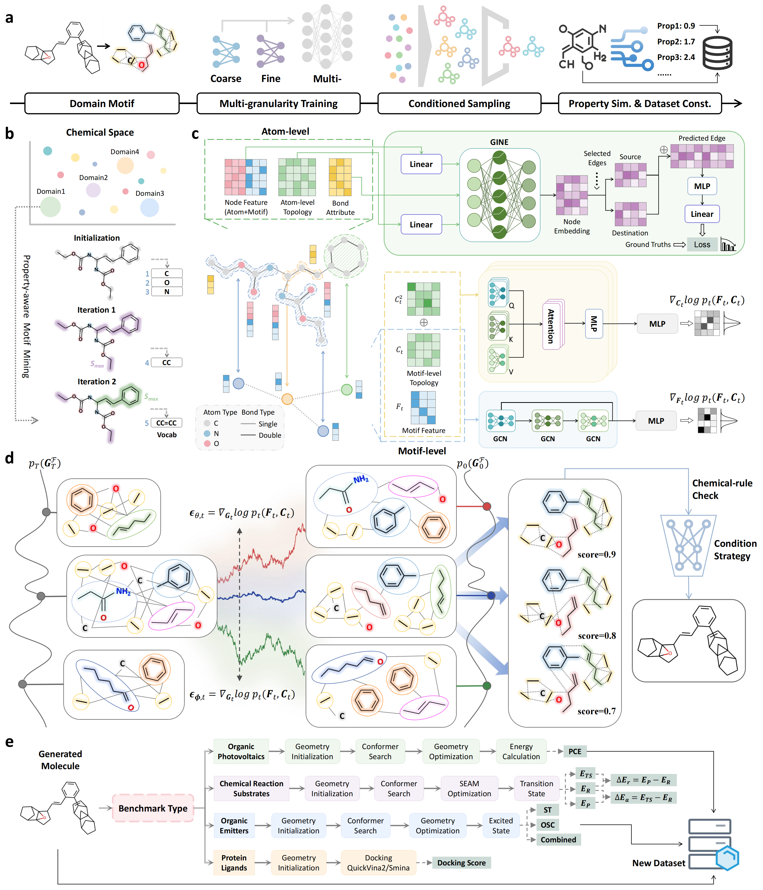

# DM-Assembler: Leveraging Domain Motif Assembler for Multi-objective, Multi-domain and Explainable Molecular Design




# Requirement

## Molecule Generation

First, create a virtual environment:

```
conda create -n gen python=3.7
```

Then, install the packages:

```
pip install -r requirements.txt
```

Finally, install pytorch_geometric:

```
pip install pyg-lib torch-scatter torch-sparse -f https://data.pyg.org/whl/torch-1.13.0+cu117.html
pip install torch-geometric
```

## Property Simulation


# Model Training


